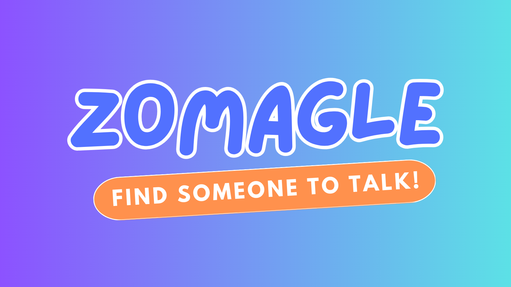

# Zomagle

**Zomagle** is a social chat application that connects users globally through country-specific chatrooms. Users can join chatrooms based on countries, states, and cities, facilitating diverse and engaging conversations. Each chatroom is cleared daily for privacy and safety.

### [zomagle.com](https://zomagle.com/)

## Key Features

- **Country-Based Chatrooms:** Join chatrooms organized by countries.
- **State and City Sub-Chatrooms:** Drill down to specific states and cities.
- **Daily Cleansing:** Chatrooms are cleared every day to ensure a clean environment.

## Future Features

We plan to enhance Zomagle with the following features:

- **Private Messaging:** Enable direct communication between users.
- **User Profiles:** Allow users to create and customize profiles.
- **Chatroom Moderation:** Tools for managing chatroom activities.
- **Event Announcements:** Create and manage events within chatrooms.
- **Enhanced Search:** Advanced search for users and chatrooms.

## Contributing

We welcome contributions from the community! To get involved:

1. **Fork the Repository:** Create a personal copy of the project.
2. **Create a New Branch:** Develop features or fix bugs on a separate branch.
3. **Submit a Pull Request:** Share your changes for review and integration.
4. **Provide Feedback:** Share thoughts and suggestions to help us improve.

## Getting Started

1. Clone the repository:
   
   ```bash
   git clone https://github.com/rishibaghel25/zomagle.git
2. Navigate to the project directory:
   ```bash
   cd zomagle
3. Install dependencies:
   ```bash
   npm install
4. Serve the application locally:
   ```bash
   npm start
5. Visit http://localhost:3000 in your browser.


## License

This project is licensed under the Apache License 2.0 - see the LICENSE file for details.

## Contact

For inquiries or feedback:

  ####  Email: rishi@zomagle.com


## Learn More

You can learn more in the [Create React App documentation](https://facebook.github.io/create-react-app/docs/getting-started).

To learn React, check out the [React documentation](https://reactjs.org/).

### Code Splitting

This section has moved here: [https://facebook.github.io/create-react-app/docs/code-splitting](https://facebook.github.io/create-react-app/docs/code-splitting)

### Analyzing the Bundle Size

This section has moved here: [https://facebook.github.io/create-react-app/docs/analyzing-the-bundle-size](https://facebook.github.io/create-react-app/docs/analyzing-the-bundle-size)

### Making a Progressive Web App

This section has moved here: [https://facebook.github.io/create-react-app/docs/making-a-progressive-web-app](https://facebook.github.io/create-react-app/docs/making-a-progressive-web-app)

### Advanced Configuration

This section has moved here: [https://facebook.github.io/create-react-app/docs/advanced-configuration](https://facebook.github.io/create-react-app/docs/advanced-configuration)

### Deployment

This section has moved here: [https://facebook.github.io/create-react-app/docs/deployment](https://facebook.github.io/create-react-app/docs/deployment)

